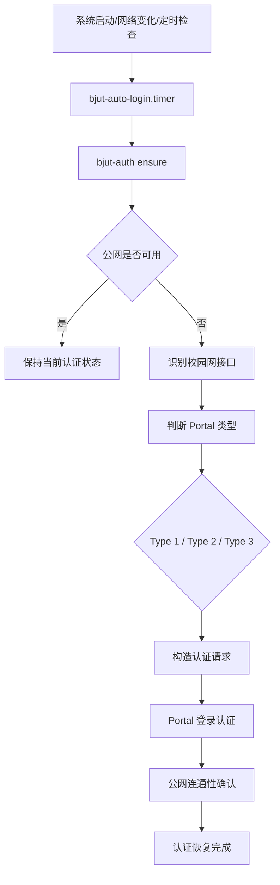
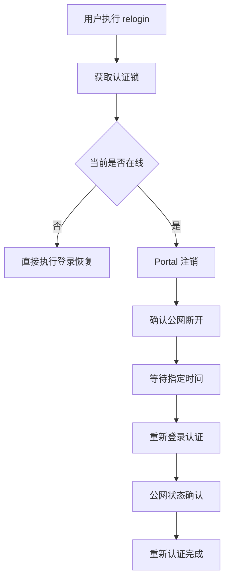
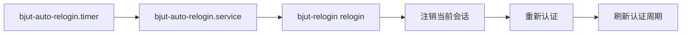

# BJUT 登录与注销技术路线图

## 自动登录流程

```mermaid
flowchart TD
    A[系统启动/网络变化/定时检查] --> B[bjut-auto-login.timer]
    B --> C[bjut-auth ensure]
    C --> D{公网是否可用}
    D -->|是| E[保持当前认证状态]
    D -->|否| F[识别校园网接口]
    F --> G[判断 Portal 类型]
    G --> H{Type 1 / Type 2 / Type 3}
    H --> I[构造认证请求]
    I --> J[Portal 登录认证]
    J --> K[公网连通性确认]
    K --> L[认证恢复完成]
```

## 手动注销与重新认证流程

```mermaid
flowchart TD
    A[用户执行 relogin] --> B[获取认证锁]
    B --> C{当前是否在线}
    C -->|否| D[直接执行登录恢复]
    C -->|是| E[Portal 注销]
    E --> F[确认公网断开]
    F --> G[等待指定时间]
    G --> H[重新登录认证]
    H --> I[公网状态确认]
    I --> J[重新认证完成]
```

## 定时重新认证

```mermaid
flowchart LR
    A[bjut-auto-relogin.timer] --> B[bjut-auto-relogin.service]
    B --> C[bjut-relogin relogin]
    C --> D[注销当前会话]
    D --> E[重新认证]
    E --> F[刷新认证周期]
```

## 核心设计

- `ensure`：解决认证失效后的自动恢复。
- `relogin`：主动刷新校园网认证会话。
- `flock`：避免自动恢复与主动重新登录同时执行。
- `systemd timer`：提供周期性任务调度。
